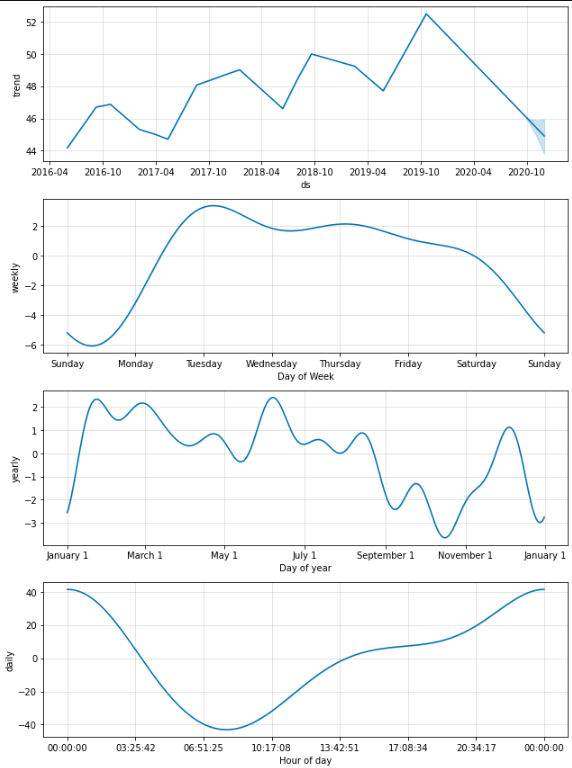

# Time Series Forecasting

## Overview and Purpose
This project uses Pandas and [Prophet](https://facebook.github.io/prophet/) along with time series data in the form of search traffic, stock prices, and daily revenue to identify trends and make predictions with the goal of maximizing profitability.

For this project we were asked to consider the following scenario:

You’re a growth analyst at [MercadoLibre](http://investor.mercadolibre.com/investor-relations). With over 200 million users, MercadoLibre is the most popular e-commerce site in Latin America. You've been tasked with analyzing the company's financial and user data in clever ways to make the company grow. So, you want to find out if the ability to predict search traffic can translate into the ability to successfully trade the stock. In a bid to drive revenue, you’ll produce a Jupyter notebook that contains your data preparation, analysis, and visualizations for all the time series data that the company needs to understand.

---

## Finding Patterns in the Search Traffic

For this section: we were presented the following scenario:

>The data science manager asks if the Google search traffic for the company links to any financial events at the company. Or, does the search traffic data just present random noise? To answer this question, pick out any unusual patterns in the Google search data for the company, and connect them to the corporate financial events.

In May 2020, MercadoLibre released its quarterly financial results. We were asked if the Google search traffic increased during that month, possibly in response to this event. To answer this question, I plotted the search trends for May 2020, calculated the total monthly traffic for that month, and compared that month to the median monthly traffic of the other months in the dataset.


```
# Calculate the sum of the total search traffic for May 2020
traffic_may_2020 = df_may_2020.sum()

# Calcluate the monthly median search traffic across all months
median_monthly_traffic = df_mercado_trends.groupby(by=[df_mercado_trends.index.year, df_mercado_trends.index.month]).sum().median()

# Compare the search traffic for the month of May 2020 to the overall monthly median value
traffic_may_2020/median_monthly_traffic
```

This calculation showed that there was an 8% increase in search trends in May compared to the median, and also the search trends seem to spike on May 5th. However, I don't think we have enough information to determine whether or not the release of the quarterly financial results was the cause of these increases.

## Mining the Search Traffic Data for Seasonality
For this section, we addressed the following scenario:

>Marketing realizes that they can use the hourly search data, too. If they can track and predict interest in the company and its platform for any time of day, they can focus their marketing efforts around the times that have the most traffic. This will get a greater return on investment (ROI) from their marketing budget. To that end, you want to mine the search traffic data for predictable seasonal patterns of interest in the company.

To identify these patterns, I plotted the search traffic data according to day of the week, hour of the day, and week of the year.

```
# Group the hourly search data to plot (use hvPlot) the average traffic by the day of week 
df_mercado_trends.groupby(df_mercado_trends.index.dayofweek).mean().hvplot(
    title='MercadoLibre Search Trends by Day of Week',
    xlabel='Day of Week - Monday-Sunday'
)
```


```
# Use hvPlot to visualize the hour of the day and day of week search traffic as a heatmap.
df_mercado_trends.hvplot.heatmap(
    x='index.hour',
    y='index.dayofweek',
    C='Search Trends',
    cmap='blues',
    title='MercadoLibre Search Trends by Hour of Day and Day of Week',
    ylabel='Day of Week - Monday-Sunday',
    xlabel='Hour of Day'
).aggregate(function=np.mean)
```


```
# Group the hourly search data to plot (use hvPlot) the average traffic by the week of the year
df_mercado_trends.groupby(df_mercado_trends.index.weekofyear).mean().hvplot(
    title='MercadoLibre Google Search Trends by Week of Year',
    xlabel='Week of Year'
)
```


From these visualizations we can determine:

* The search trends seem to be higher during the week and taper off on the weekend.
* Across all of the days of the week, the search traffic appears to concentrate the most between 0:00 and 3:00, and 21:00 and 23:00.
* When asked if search traffic increased during the winter holiday period, we can see that although the search traffic decreased between week 40 and 42 (the first two weeks of October), for the rest of the winter holiday period it does tend to increase, and then decreases sharply between week 51 and 52 (after Christmas).

## Relating the Search Traffic to Stock Price Patterns

In this section, we explore the relationship between search data and company stock price.

>You mention your work on the search traffic data during a meeting with people in the finance group at the company. They want to know if any relationship between the search data and the company stock price exists, and they ask if you can investigate.

To do this, I first concatenated the stock price and search trend DataFrames into one. I then sliced the data to focus on the first 6 months of 2020, when the COVID-19 pandemic destabilized global financial markets. The goal was to determine if the trends in our data supported the narrative that, although the pandemic caused damage to the market initially, e-commerce platforms were able to recover fairly quickly due to the global demand for socially-distant shopping.

```
first_half_2020.hvplot(
    shared_axes=False,
    subplots=True).cols(1)
```


From these plots we can see that our data does seem consistent with the above narrative. Although the stock prices and search traffic dropped after March of 2020, the stock prices more so, both did eventually recover. Starting in May 2020, the stock price began to climb past pre-pandemic levels.

Finally, for this section we were asked to find the correlation between the search trends, stock volatility, and hourly stock return.


Create a new column in the mercado_stock_trends_df DataFrame called Lagged Search Trends:
```
mercado_stock_trends_df['Lagged Search Trends'] = mercado_stock_trends_df['Search Trends'].shift(1)
```

Create a new column in the mercado_stock_trends_df DataFrame called Stock Volatility:
```
mercado_stock_trends_df['Stock Volatility'] = mercado_stock_trends_df['close'].pct_change().rolling(window=4).std()
```

Create a new column in the mercado_stock_trends_df DataFrame called Hourly Stock Return:

```
mercado_stock_trends_df['Hourly Stock Return'] = mercado_stock_trends_df['close'].pct_change()
```

Construct correlation table of Stock Volatility, Lagged Search Trends, and Hourly Stock Return:
```
mercado_stock_trends_df[['Stock Volatility', 'Lagged Search Trends', 'Hourly Stock Return']].corr()
```


We can see that a 14% inverse relationship exists between the lagged search traffic and the stock volatility. A 1.8% positive correlation exists between the lagged search traffic and the stock price return.

## Creating a Time Series Model with Prophet

In this section, I used Prophet to forecast patterns in the search data. The forecast predicts 2000 hours, or 80 days, into the future, on an hourly basis.

I used hvplot to visualize the `yhat`, `yhat_lower`, and `yhat_upper` columns of the forecast. `yhat` represents the values that the algorithm determines are most likely, where `yhat_upper` and `yhat_lower` represent the best-case and worst-case scenario values, respectively.

```
forecast_mercado_trends[['yhat', 'yhat_lower', 'yhat_upper']].iloc[-2000:,:].hvplot(
    height=400,
    width=1300,
    ylabel='Search Trends',
    xlabel='Date'
)
```


This visualization looks similar to the earlier visualization for the May 2020 search trends, following the patterns we identified earlier relating to hour of the day and day of the week.

We can visualize these trends identified earlier by plotting the components of the forecast:

```
figures_mercado_trends = model_mercado_trends.plot_components(forecast_mercado_trends);
```



## Forecasting Revenue Using Time-Series Models
We were given the option for this project to add an additional section to the notebook, considering this scenario:

>A few weeks after your initial analysis, the finance group follows up to find out if you can help them solve a different problem. Your fame as a growth analyst in the company continues to grow! Specifically, the finance group wants a forecast of the total sales for the next quarter. This will dramatically increase their ability to plan budgets and to help guide expectations for the company investors.

To accomplish this, I created a Prophet forecast based on revenue data in the `mercado_daily_revenue.csv` file. Since the goal was to predict the next quarter's total revenue, the model forecasts 90 days, or one quarter, into the future, with a daily frequency.

I then created a DataFrame containing only the future predictions and the `yhat`, `yhat_lower` and `yhat_upper` columns. To calculate the total revenue predictions, I summed the values of the columns.

```
mercado_sales_forecast_quarter = mercado_sales_prophet_forecast.loc['2020-07-01':'2020-09-30']

mercado_sales_forecast_quarter = mercado_sales_forecast_quarter[['yhat', 'yhat_lower', 'yhat_upper']]

mercado_sales_forecast_quarter.sum()
```


```
yhat           969.559258
yhat_lower     886.883498
yhat_upper    1051.517026
dtype: float64
```

Based on the forecast information, the finance division can expect a most likely outcome of 969.56 million dollars of total sales for the next quarter, with a worst case scenario of 887.45 million dollars of total sales, and a best case scenario of 1.052 billion dollars of total sales.

---

## Technologies

* Python 3.9
* Jupyter Lab and Jupyter Notebooks
* Python libraries: Pandas, Numpy, Holoviews, Datetime, Pathlib, Prophet

---

## Contributors
Lydia Ciummo - lydiaciummo@hotmail.com

---

## License
GNU General Public License v3.0